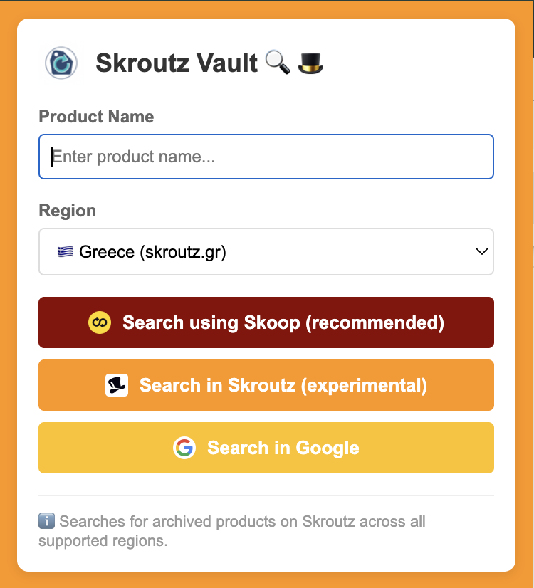

# 🔍🎩 Skroutz Vault

This is a Chrome extension to search for the one thing Skroutz can't easily find: **old products**. 

Ever wondered about a product that's no longer listed on Skroutz? Looking for discontinued models, older versions, or vintage items? Skroutz removes old product listings, making it nearly impossible to find them through normal search. That's where Skroutz Vault comes in.

Skroutz Vault gives you instant access to search Skroutz's archived products across all supported regions with a single click. No more hunting through Google caches or old forum posts. Just type what you're looking for, pick your region, and discover products that have disappeared from the main catalog.

**Perfect for:**
- 📱 Finding older phone models and specifications
- 💻 Searching for discontinued tech products
- 🛒 Researching price history of past products
- ⭐ Updating your lists of favorite items
- 🔎 Locating products you remember but can't find anymore
- 🌍 Comparing archived products across different regions

## ⚠️ Disclaimer

**This is a personal project with no affiliation, collaboration, or endorsement from Skroutz.** This extension is independently developed and maintained. It is not officially supported by Skroutz and has no connection to the company or its services beyond using their public websites.

## ✨ Features

- 🔍 Multiple search options:
  - **Skoop Database Search** (Recommended) - Search using Skoop's SKU database with detailed product information including category and minimum price. Only available for Greece (GR) region and requires Skoop to be enabled in your account.
  - **Skroutz Search** (Experimental) - Search archived products on the main Skroutz website
  - **Google Search** - Search for products using Google with Skroutz domain filter
- 🌍 Support for multiple regions:
  - 🇬🇷 Greece (skroutz.gr)
  - 🇨🇾 Cyprus (skroutz.com.cy)
  - 🇪🇺 Europe (skroutz.eu)
  - 🇧🇬 Bulgaria (skroutz.bg)
  - 🇷🇴 Romania (skroutz.ro)
  - 🇩🇪 Germany (skroutz.de)
- ⌨️ Press Enter to search or use the button
- 🎯 Opens search results in a new tab or window

## 📥 Installation (developer mode)

1. Clone or download this repository
2. Open Chrome and go to `chrome://extensions/`
3. Enable "Developer mode" (top right)
4. Click "Load unpacked"
5. Select the repository folder
6. The extension is now ready to use!

## 🎮 Usage

1. Click the Skroutz Vault extension icon
2. Enter a product name
3. Select a region from the dropdown
4. Choose a search option:
   - **Search using Skoop database** - For Greece region only. Shows product details including category and minimum price. Requires Skoop to be enabled in your Skroutz account.
   - **Search in Skroutz** - Searches archived products across all regions
   - **Search in Google** - Uses Google to search for products with Skroutz domain filter
5. Results will open in a new tab or window

### UI Preview

## 📁 Files

- `manifest.json` - Extension configuration
- `popup.html` - UI for the extension popup
- `popup.js` - Popup logic and region handling
- `background.js` - Background service worker
- `icons/` - Extension icons
- `resources/` - Screenshots and documentation assets
- `scripts/` - Build and automation scripts
- `PRIVACY.md` - Privacy policy for Chrome Store
- `CHANGELOG.md` - Version history and changes
- `VERSIONING.md` - Versioning guidelines

## 📄 License

MIT License - See LICENSE file for details

## 🤝 Contributing

This is a personal project. Feel free to fork and modify for your own use.

---

**Note:** This project is developed independently and is not affiliated with Skroutz in any way.
